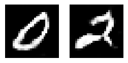
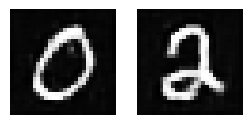

# WcGAN-GP-MNIST

[][mysite]

> The notebook is better visualized using Google Colab:
> 
>  

The main objective is to train a conditional GAN and use its generator to create images. Since GANs require a lot of computational resources, the dataset size and the number of classes used will be restricted. My main objective is to see the entire process of training a GAN.

To keep track of the training loss and the images generated, TensorBoard was used. Moreover, to prevent the well-known mode collapse, present in basic GAN implementations, I used the Wasserstein loss with a gradient penalty.

The images below show the results for two different models:

|:--:| 
| *Images generated by a simpler model.* |

|:--:| 
| *Images generated by a more powerfull model.* |

[mysite]: https://rgivisiez.github.io/
